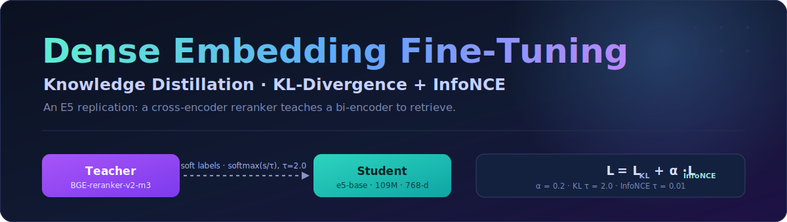

<div align="center">



<br/>

### Teaching a small bi-encoder to retrieve like a heavy cross-encoder — by distilling the reranker's knowledge into E5 using KL_Div.

A faithful replication of the **E5** fine-tuning recipe: a `BGE-reranker-v2-m3` cross-encoder grades query–passage pairs, and an `e5-base` bi-encoder learns to imitate that ranking through a hybrid **KL-Divergence + InfoNCE** loss. The reranker never ships — only its soft labels do.

<br/>

[-B31B1B?style=for-the-badge&logo=arxiv&logoColor=white)](https://arxiv.org/abs/2212.03533)
&nbsp;

<br/>


</div>

---

## The problem I was solving

A bi-encoder is fast. You embed every passage once, drop the vectors in an index, and answer queries with a dot product. The catch is that it scores each side in isolation — the query never *sees* the passage — so it routinely ranks a plausible-looking decoy above the real answer.

A cross-encoder doesn't have that blind spot. It reads the query and passage *together* and judges the pair, which makes it far more accurate and far too slow to run over millions of documents at query time.

So you get the obvious idea: keep the cross-encoder's judgement, throw away its cost. Let the slow, accurate model **grade** training pairs once, offline, and have the fast model **learn to agree with it**. That is what this repo does — it reproduces the E5 distillation recipe from [Wang et al., 2022](https://arxiv.org/abs/2212.03533), where a reranker's soft rankings become the training signal for the embedding model.

```
   e5-base (unsupervised)        after KD + InfoNCE          what ships
   embeds query & passage   ->   ranks like the         ->   a 768-d bi-encoder,
   apart, ranks softly           cross-encoder taught it      cross-encoder-grade order
```

---

## The recipe

```mermaid
flowchart LR
    subgraph OFFLINE [Offline · done once, on CPU/GPU]
      direction TB
      DPR[(DPR top-k<br/>hard negatives)] --> TEA[BGE-reranker-v2-m3<br/>cross-encoder]
      TEA --> SM[softmax over the 8<br/>scores · &#964; = 2.0]
      SM --> LAB[(soft label<br/>p_pos, p_neg1..7)]
    end

    LAB --> STU

    subgraph TRAIN [Online · SentenceTransformerTrainer]
      direction TB
      STU[e5-base-unsupervised<br/>mean-pool + L2 norm] --> KL[KL Divergence<br/>match the teacher]
      STU --> NCE[InfoNCE<br/>hard + in-batch negs]
      KL --> TOT[L = L_KL + &#945;&#183;L_InfoNCE]
      NCE --> TOT
    end

    TOT --> EVAL[BEIR NQ<br/>nDCG / Recall / MRR]

    classDef tea fill:#7C3AED,stroke:#306,color:#fff;
    classDef stu fill:#0EA5A4,stroke:#063,color:#fff;
    classDef ev fill:#2EA043,stroke:#063,color:#fff;
    class TEA,SM tea;
    class STU stu;
    class EVAL ev;
```



**The teacher grades, offline.** For every query I take 1 positive + 7 hard negatives, score all eight `(query, passage)` pairs with `BGE-reranker-v2-m3`, and `softmax` those scores at `τ = 2.0`. That turns a row of raw logits into a probability distribution over the eight candidates — a *soft* answer key that says not just "this one's right" but "and this decoy is the second-most tempting." Those distributions are computed once and cached as datasets; the heavy model is never loaded during training.

**The student learns to agree.** `e5-base-unsupervised` (109M params, 768-d) embeds the query and all eight passages, mean-pools, L2-normalises, and is trained against two losses at once:

- **KL divergence** pulls the student's own softmax over the eight candidates toward the teacher's distribution — this is the distillation.
- **InfoNCE** is the standard contrastive pull: positive close, negatives far, using *both* the 7 per-query hard negatives and the other positives in the batch as in-batch negatives.

The two are combined as `L = L_KL + α·L_InfoNCE` with `α = 0.2`, exactly as in the paper.

---

## The two losses, precisely

$$\mathcal{L} = \mathcal{L}_{\text{KL}} + \alpha \cdot \mathcal{L}_{\text{InfoNCE}}$$

**KL divergence — knowledge distillation.** Match the student's candidate distribution to the teacher's:

$$\mathcal{L}_{\text{KL}} = D_{\text{KL}}\!\left( p^{\text{teacher}} \,\|\, p^{\text{student}} \right) = \sum_{i=1}^{K} p_i^{\text{teacher}} \log \frac{p_i^{\text{teacher}}}{p_i^{\text{student}}}$$

- $p^{\text{teacher}}_i = \text{softmax}(s_i^{\text{teacher}} / \tau)$, the cached reranker distribution, $\tau = 2.0$
- $p^{\text{student}}_i = \text{softmax}(\text{sim}(q, d_i) / \tau)$, cosine similarities from the student
- $K = 8$ — one positive plus seven hard negatives

**InfoNCE — contrastive.** Sharpen the geometry so the right passage sits closest:

$$\mathcal{L}_{\text{InfoNCE}} = -\log \frac{\exp(\text{sim}(q, d^+) / \tau_c)}{\exp(\text{sim}(q, d^+) / \tau_c) + \sum_{j}\exp(\text{sim}(q, d_j^-) / \tau_c)}$$

- $\tau_c = 0.01$ — a sharp contrastive temperature
- negatives = 7 hard negatives per query **+** $(B-1)$ in-batch negatives (every other positive in the batch)

Why both? KL alone teaches the *ordering* the teacher prefers but is loose about absolute geometry; InfoNCE alone has a hard one-hot target and ignores how tempting each decoy is. Together the student inherits the teacher's nuanced ranking *and* a tight, retrieval-ready embedding space.

---

## The data, and how it was built

Hard negatives are where retrieval distillation lives or dies — random negatives are too easy to teach anything. So the labels come out of a small mining pipeline rather than off the shelf:

```
DPR top-k retrieval          BGE reranker scoring           Softmax (τ = 2.0)
┌──────────────────┐     ┌──────────────────────┐     ┌────────────────────┐
│  query → top-100 │ ──→ │ cross-encoder scores │ ──→ │ p(d|q) = softmax   │
│  DPR/BM25 negs   │     │ for every (q, d)     │     │ (score_i / τ)      │
└──────────────────┘     └──────────────────────┘     └─────────┬──────────┘
                                                                 │
                                              keep top-7 hard negs + 1 positive,
                                              each carrying its probability label
```

The scoring notebooks live in [`nq-gen/`](nq-gen/) and [`ms-gen/`](ms-gen/); the finished datasets are public on the Hub.

| Dataset | Queries | Hard negs / query | Source |
|---|---|---|---|
| **NQ** (Natural Questions) | 307K | 7 | [satyam2025/nq-bge-reranker-v2-m3-7hn-temperature2-softmax](https://huggingface.co/datasets/satyam2025/nq-bge-reranker-v2-m3-7hn-temperature2-softmax) |
| **MS-MARCO** | 486K | 7 | [satyam2025/msmarco-bge-reranker-v2-m3-7hn-temperature2-softmax](https://huggingface.co/datasets/satyam2025/msmarco-bge-reranker-v2-m3-7hn-temperature2-softmax) |
| **Combined** | **793K** | 7 | — |

Each row carries the teacher's distribution alongside the text:

```json
{
  "query": "what is machine learning?",
  "positives": {
    "passage": ["Machine learning is a subset of..."],
    "score":   [0.4521]
  },
  "negatives": {
    "passage": ["Deep learning...", "Statistics is...", "..."],
    "score":   [0.1234, 0.0891, "..."]
  }
}
```

For the trainer this is flattened into 9 columns — `anchor`, `positive`, `negative_1 … negative_7` — plus a `label` holding the full 8-way teacher distribution `[p_pos, p_neg1 … p_neg7]` that sums to 1.0. The E5 prefix convention is preserved throughout: queries are prefixed `"query: "`, passages `"passage: "`.

---

## Training setup, and why each choice

Every value here is straight from **E5 Paper, Table 11** — the point of a replication is to not quietly drift from it.

| Knob | Value | The reason |
|---|---|---|
| Base / student | `intfloat/e5-base-unsupervised` | the paper's starting point — pre-trained, not yet supervised |
| Teacher | `BAAI/bge-reranker-v2-m3` | strong cross-encoder; only its cached scores are used |
| Learning rate | `2e-5` | paper setting; AdamW |
| Warmup steps | `400` | gentle ramp before the main schedule |
| Batch size | `256` | big batch ⇒ many in-batch negatives, which InfoNCE feeds on |
| Max seq length | `192` train / `512` eval | short windows train fast; full length only where it matters |
| Epochs | `3` | the paper's count over the 793K combined set |
| Weight decay | `0.01` | standard regularisation |
| KL temperature `τ` | `2.0` | must match the teacher's softmax temperature |
| Contrastive temp `τ_c` | `0.01` | sharp — forces decisive separation |
| Loss weight `α` | `0.2` | KL leads, InfoNCE supports |
| Precision | BF16 + TF32 | FP32 dynamic range at FP16 speed on the A100 |

A few things that made the difference between "runs" and "fits on one GPU":

- **One forward pass for all nine texts.** Query + positive + 7 negatives get encoded together in a single batched call rather than nine separate ones — `torch.bmm` then does the similarity math with no Python loop in the hot path.
- **Gradient checkpointing** is what lets `batch_size = 256` survive on a single A100; it trades a bit of recompute for the memory headroom the large batch needs.
- **`expandable_segments`** keeps memory fragmentation from OOM-ing a run that would otherwise have fit.
- **`NO_DUPLICATES` batch sampler** (from `sentence-transformers`) guarantees the in-batch negatives are genuinely *other* queries' positives — no accidental duplicate leaking in as a false negative.

---

## Did it work? BEIR NQ (test)

The honest test for a retrieval model is a clean benchmark it never trained on. I evaluate on the **BEIR NQ** test split — 3,452 queries against a 2.68M-document corpus — encoding the whole corpus in FP16 and scoring the standard ranking metrics.

| Metric | E5 Paper | This replication |
|---|:---:|:---:|
| **nDCG@10** | **~0.590** | **0.575** |
| nDCG@5 | — | 0.537 |
| nDCG@1 | — | 0.391 |
| Recall@10 | — | 0.780 |
| Recall@5 | — | 0.669 |
| MRR@10 | — | 0.526 |

```text
nDCG@10     paper  ###################.  ~0.590
       replication  ##################..   0.575   ->  within ~1.5 pts
Recall@10     ours  ###############.....   0.780
MRR@10        ours  ##########..........   0.526
```

Landing at **0.575 nDCG@10** against the paper's **~0.590** — within about one and a half points — is the result I was after: close enough to call the recipe faithfully reproduced, on a single A100, from public data. I'm listing the full row of metrics rather than the single flattering one; the gap is small and consistent, which is exactly what a clean replication should look like.

---

## Run it yourself

Both stages are Colab notebooks built around an A100.

```python
# 1 · Train  —  KD_and_InfoNCE_finetuning_GOLD_final_code.ipynb
#     A100, ~40GB VRAM at batch_size=256, ~6h for 3 epochs over 793K pairs.
#     Pulls the two pre-scored HF datasets; no teacher model loaded at train time.

# 2 · Evaluate  —  EVAL_BEIR_NQ_E5_Finetuned.ipynb
#     Downloads the BEIR NQ test split (2.68M docs), encodes in FP16,
#     reports nDCG@{1,5,10}, Recall@{1,5,10}, MRR@10.
```

Want to regenerate the labels from scratch instead of using the published datasets? The scoring notebooks in [`nq-gen/`](nq-gen/) and [`ms-gen/`](ms-gen/) run the reranker over the mined hard negatives and emit the `softmax(τ=2.0)` distributions.

---

## Where things live

```
.
├── KD_and_InfoNCE_finetuning_GOLD_final_code.ipynb   training: hybrid KD + InfoNCE loss (Colab A100)
├── EVAL_BEIR_NQ_E5_Finetuned.ipynb                   evaluation: BEIR NQ, nDCG / Recall / MRR
├── nq-gen/
│   └── NQ_BGE_Complete.ipynb                          NQ — BGE-reranker scoring → softmax labels
├── ms-gen/
│   └── MSMARCO_BGE_Complete.ipynb                     MS-MARCO — BGE-reranker scoring → softmax labels
└── assets/
    └── banner.svg
```

The custom loss (`OptimizedE5HybridLoss`) lives inside the training notebook: it runs the single nine-text forward pass, computes the KL term against the cached teacher distribution and the InfoNCE term over hard + in-batch negatives, and returns `KL + α·InfoNCE`.

---

## References

- **E5 Paper** — [Text Embeddings by Weakly-Supervised Contrastive Pre-training](https://arxiv.org/abs/2212.03533) (Wang et al., 2022)
- **Student model** — [intfloat/e5-base-unsupervised](https://huggingface.co/intfloat/e5-base-unsupervised)
- **Teacher model** — [BAAI/bge-reranker-v2-m3](https://huggingface.co/BAAI/bge-reranker-v2-m3)
- **BEIR benchmark** — [beir-cellar/beir](https://github.com/beir-cellar/beir)
- **DPR** — [Dense Passage Retrieval](https://github.com/facebookresearch/DPR)
- **Sentence Transformers** — [UKPLab/sentence-transformers](https://github.com/UKPLab/sentence-transformers)

<div align="center">

**If this replication was useful, a star goes a long way.**

</div>
